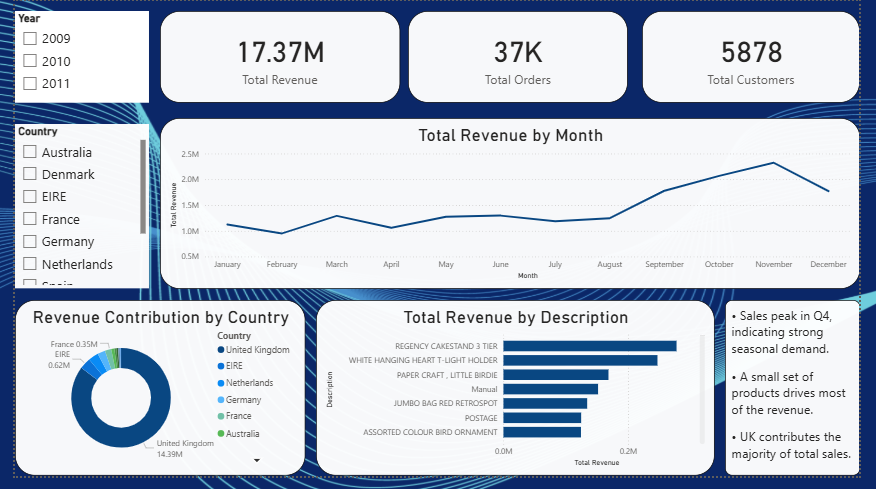

# E-Commerce Sales Performance & Customer Insights Analysis

## Overview
This project analyzes real-world e-commerce transaction data to understand sales trends, customer behavior, and product performance.

## Tools & Technologies
- Python (Pandas, Matplotlib, Seaborn)
- MySQL
- Power BI
- Google Colab

## Dataset
Online Retail Dataset (Kaggle)

## Key Analysis
- Data cleaning and preprocessing
- Exploratory data analysis (EDA)
- SQL-based business reporting
- Power BI dashboard for executive insights

## Key Insights
- Sales peak during Q4 indicating seasonal demand
- Few products contribute most of the revenue
- UK dominates total sales

## Dashboard

## Conclusion
This project analyzes e-commerce sales data using **SQL and Power BI** to deliver clear, interactive business insights. The dashboard highlights **Q4 seasonal sales growth**, identifies the **UK as the primary revenue contributor**, and shows that **a small set of products drives most revenue**. It demonstrates practical skills in data analysis, visualization, and business-focused reporting.

